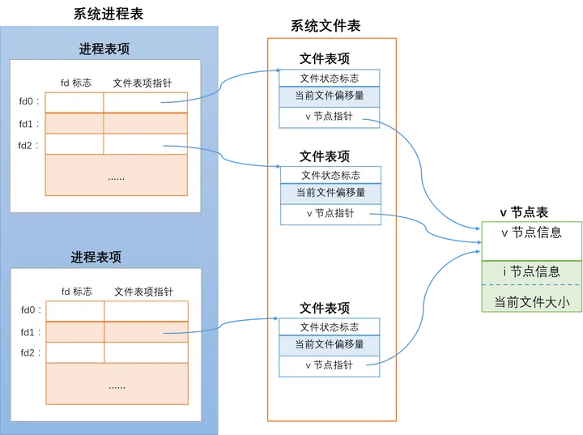

## flock文件锁
在多进程调度下，经常出现文件读写冲突问题。为解决文件共享的冲突，linux提供flock这一系统调用，来实现多进程下对文件读取的保护。

### 命令
以排他锁为例，其中参数-x表示为排他锁，file.lock表示代表锁的文件，-c表示获取锁后将要执行的命令。当我们执行`flock -x file.lock -c 'echo hello world'`时，会执行以下步骤：

1. 寻找file.lock文件，如果没有该文件，会去创建。
2. 尝试获取锁
3. 如果没有其他进程上锁，则获取该锁，并执行echo hello world命令
4. 如果其他进程上锁，则等待其他进程释放该锁，然后重复第2~4步
5. 释放锁

### 实现细节
flock与linux文件系统与进程息息相关。主要介绍两张表，系统进程表和文件表。

在系统进程表中，每个进程表项代表了一个进程的基本信息，在进程表项中，有一个文件描述符表，其存储了该进程打开的所有文件描述符信息和对应文件表项的指针。

在文件表中，每个文件表项存储了一个打开文件的相关信息，所有文件表项构成了所有进程打开的所有文件的相关信息。每个文件表项包含了一个指针，该指针指向了文件的真实内容。



从图中可以看出，进程1对同一个文件打开了两次，分别对应本进程中的文件描述符fd0和 fd2。而下面的进程对这个文件又打开了一次，对应此进程中的fd1描述符。要注意的是，不论是同一进程还是不同的进程，对同一文件打开时，都建立了与各fd对应的独立的文件表项。

flock上锁时就是对文件表项进行上锁。假如图中位于下方的进程对fd1 加上了排他锁，实际就是加在了fd1 指向的文件表项上，这时上方的进程对 fd0 或 fd2 再加任何类型的文件锁都会失败。这是因为操作系统会检测到上方的两个文件表项和下方的文件表项都指向了相同的 v 节点，并且下方的文件表项已经加了排他锁，这时如果其他指向相同v 节点的文件表项再想尝试加上与原有锁类型不相容的文件锁时，操作系统会将此文件表项对应的进程阻塞。

### 相关应用
#### 多进程文件读写不一致问题
假设存在这样一个场景，进程A、B同时对某个文件进行写操作，由于没有做加锁的限制，导致最终时刻文件与进程A、B保存文件时刻文件内容不一致的后果。

在该场景中，如果进程A与B是在同一个脚本中，可以通过对代码块加锁，并行调度的方式来保证读写一致性。但如果针对于两个独立进程，每个进程读写文件的方式不一样（例如，进程A通过操作系统命令写文件而进程B通过执行shell脚本），则需要使用flock。

flock机制可以帮助解决多进程调度下的文件共享问题。通过flock给文件写操作加上排他锁，给文件都操作加上共享锁。这样当某个进程写文件时，其他文件无法进行读写操作；但当某个进程读文件时，其他进程可以进行读操作，无法进行写操作。通过这种“读写锁”的机制，可以保证读写的一致性。

#### 定时任务串行化
在crontab定时任务中，可能出现某个定时任务超过crontab设定的执行周期，导致周期结束时，该任务还未完成而又启动该任务的新实例。

对于上述场景，通过flock对该任务上锁，可将crontab的任务周期性执行串行化

```
* * * * * python3 test.py
```
上面的crontab任务项表示，每分钟执行一次python3 test.py命令，如果test.py执行时长超过一分钟，则会有启动新的任务实例，最后导致资源耗尽。
```
* * * * * flock -xn /tmp/test.lock -c 'python3 test.py'
```
而该crontab任务项表示，每个任务实例会先尝试获取/tmp/test.lock锁，只有当获取锁之后，才执行python3 test.py命令，防止出现多个任务实例。
其中-n参数表示为非阻塞运行，当获取锁失败时，直接返回而不是阻塞等待锁。

### 参考
[flock文件锁](https://zhuanlan.zhihu.com/p/25134841)
