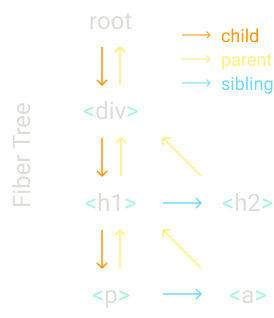

# react源码学习
学习[build-your-own-react](https://pomb.us/build-your-own-react/)，实现一个包括时间切片、fibers架构和Hooks的简易React。
## render
这儿有一段简单的JSX语句：
```
const element = <h1 title="foo">Hello</h1>
const container = document.getElementById("root")
ReactDOM.render(element, container)
```

### createElement的实现
`const element = <h1 title="foo">Hello</h1>`是一个JSX语法，在react中会转换为
```
const element = React.createElement(
  "h1",
  { title: "foo" },
  "Hello"
)
```
这里的`createElement`方法传入type，props和children，然后返回特定的字典：
```
function createElement(type, props, ...children) {
  return {
    type,
    props: {
      ...props,
      children,
    },
  }
}
```
该字典包含了一个dom节点的所有信息。

上例中生成的字典是：
```
{
    type: "h1",
    props: {
        "children": ["Hello"],
        "title": "foo"
    }
}
```
### render的实现
`render`实际上就是解析上述字典，然后调用`Document`对象方法生成目标节点。
相关代码实现如下：
```
function render(element, container) {
  const dom = document.createElement(element.type)
​  const isProperty = key => key !== "children"
  Object.keys(element.props)
    .filter(isProperty)
    .forEach(name => {
      dom[name] = element.props[name]
    })
  element.props.children.forEach(child =>
    render(child, dom)
  )
  container.appendChild(dom)
}
```
这里会先创建指定类型的节点，然后将除了children以外的props赋给节点。最后再递归render所有children节点，从而完成该节点的渲染。

### render的并发实现
如果children过多，render时间过长，会造成阻塞。因此需要将渲染工作分成小块（unit of work），在切片时间里做这些工作。

首先定义`workLoop`函数，该方法会在空闲时一直执行渲染工作：
```
let nextUnitOfWork = null
​
function workLoop(deadline) {
  let shouldYield = false
  while (nextUnitOfWork && !shouldYield) {
    nextUnitOfWork = performUnitOfWork(
      nextUnitOfWork
    )
    shouldYield = deadline.timeRemaining() < 1
  }
  requestIdleCallback(workLoop)
}
​
requestIdleCallback(workLoop)
​
function performUnitOfWork(nextUnitOfWork) {
  // TODO
}
```

这里的`performUnitOfWork`方法会执行一小块工作，同时返回下一块。在切片时间内，会一直做下去。

`requestIdleCallBack`方法用来在Idle（空闲）状态下调用回调函数，这里调用的是`workLoop`。

每当机器空闲时，会进行切片工作，不会造成阻塞，从而给用户流畅的用户体验。

## fibers架构

由上文可知，`performUnitOfWork`方法会执行当前的unit of work，同时更新nextUnitOfWork，这是如何实现的？

### fibers

`fibers`是一个数据结构，通过`child`、`parent`、`sibling`三种指针，将DOM元素组织起来，形成`fiber tree`，从而能够更快的获取`nextUnitOfWork`。

假设有以下的例子：
```
React.render(
  <div>
    <h1>
      <p />
      <a />
    </h1>
    <h2 />
  </div>,
  container
)
```

对应的`fiber tree`结构如下：




### performUnitWork的具体步骤

`performUnitOfWork`基于fibers架构，具体步骤如下：
1. 添加元素到DOM中
2. 创建该元素的子节点的fibers结构
3. 选择nextUnitOfWork：
    1. 优先选择子节点。在上例中，div fiber结束渲染后，nextUnitOfWork应该为h1 fiber
    2. 其次选择兄弟节点。p fiber没有子节点，nextUnitOfWork应该为a fiber
    3. 然后选择“叔叔”节点（父节点的兄弟节点）。a fiber结束后，nextUnitOfWork应该为h2
    4. 向上递归到root节点。h2 fiber结束后，返回div root fiber，结束渲染流程

### 代码实现

`createDom`实现如下
```
function createDom(fiber) {
  const dom =
    fiber.type == "TEXT_ELEMENT"
      ? document.createTextNode("")
      : document.createElement(fiber.type)
​
  const isProperty = key => key !== "children"
  Object.keys(fiber.props)
    .filter(isProperty)
    .forEach(name => {
      dom[name] = fiber.props[name]
    })
​
  return dom
}
```

`render`实现如下：
```
function render(element, container) {
  nextUnitOfWork = {
    dom: container,
    props: {
      children: [element],
    },
  }
}
```

这里将原来的render拆分成createDom和render两个方法。createDom用来创建DOM节点，而render用来初始化nextUnitOfWork（要渲染的根节点）。

在workLoop中，会不断调用performUnitOfWork方法，通过上文提到的选择节点原则，更新nextUnitOfWork：
```
function workLoop(deadline) {
  let shouldYield = false
  while (nextUnitOfWork && !shouldYield) {
    nextUnitOfWork = performUnitOfWork(
      nextUnitOfWork
    )
    shouldYield = deadline.timeRemaining() < 1
  }
  requestIdleCallback(workLoop)
}
```

`performUnitOfWork`实现如下：
```
function performUnitOfWork(fiber) {
  if (!fiber.dom) {
    fiber.dom = createDom(fiber)
  }
​
  if (fiber.parent) {
    fiber.parent.dom.appendChild(fiber.dom)
  }
​
  const elements = fiber.props.children
  let index = 0
  let prevSibling = null
​  // 建立fiber tree
  while (index < elements.length) {
    const element = elements[index]
​
    const newFiber = {
      type: element.type,
      props: element.props,
      parent: fiber,
      dom: null,
    }
​
    if (index === 0) {
      fiber.child = newFiber
    } else {
      prevSibling.sibling = newFiber
    }
​
    prevSibling = newFiber
    index++
  }
​  // 这里是选择节点的原则：先子节点、再兄弟节点、再叔叔节点，然后向上回溯
  if (fiber.child) {
    return fiber.child
  }
  let nextFiber = fiber
  while (nextFiber) {
    if (nextFiber.sibling) {
      return nextFiber.sibling
    }
    nextFiber = nextFiber.parent
  }
}
```

## commit阶段

### commit的基础实现
由前文可知，每次在切片时间渲染一部分DOM节点，但在整个DOM Tree渲染完成之前，浏览器可能打断我们的渲染过程。

因此，为了不让用户看到未完全渲染的UI，需要在整个DOM Tree渲染完成后，再提交渲染。

所谓`commit`，就是这个提交动作。其重点在于，何时判断整个DOM Tree的渲染已完成。

从代码实现上，我们需要记录fiber tree的root节点：

```
function render(element, container) {
  wipRoot = {
    dom: container,
    props: {
      children: [element],
    },
  }
  nextUnitOfWork = wipRoot
}
​
let nextUnitOfWork = null
let wipRoot = null
```

在`workLoop`中，一旦完成完整DOM Tree的渲染，再通过`commitRoot`提交渲染：
```
function workLoop(deadline) {
  let shouldYield = false
  while (nextUnitOfWork && !shouldYield) {
    nextUnitOfWork = performUnitOfWork(
      nextUnitOfWork
    )
    shouldYield = deadline.timeRemaining() < 1
  }
​  // 当没有nextUnitOfWork且未提交过时，进行提交
  if (!nextUnitOfWork && wipRoot) {
    commitRoot()
  }
​
  requestIdleCallback(workLoop)
}
```
`commitRoot`中通过递归将整个DOM 节点的fibers进行提交：
```
function commitRoot() {
  commitWork(wipRoot.child)
  wipRoot = null
}
​
function commitWork(fiber) {
  if (!fiber) {
    return
  }
  const domParent = fiber.parent.dom
  domParent.appendChild(fiber.dom)  // 将子节点挂到dom上
  commitWork(fiber.child)
  commitWork(fiber.sibling)
}
```

### 更新与删除

除了将节点添加到dom中，还会遇到节点更新和删除的情况。因此，我们需要保存上一次提交时的fiber tree，用于比较两次渲染的差异，从而实现最小化更新。

对于每个fiber节点，新增`alternate`属性，用于链接上次提交时的old fiber，这里的old fiber就是`currentRoot`：
```
function render(element, container) {
  wipRoot = {
    dom: container,
    props: {
      children: [element],
    },
    alternate: currentRoot,
  }
  nextUnitOfWork = wipRoot
}
```

### reconcile

将`performUnitOfWork`方法中的**建立fiber tree**部分提取成`reconcileChildren`方法：

```
function reconcileChildren(wipFiber, elements) {
  let index = 0
  let prevSibling = null
​
  while (index < elements.length) {
    const element = elements[index]
​
    const newFiber = {
      type: element.type,
      props: element.props,
      parent: wipFiber,
      dom: null,
    }
​
    if (index === 0) {
      wipFiber.child = newFiber
    } else {
      prevSibling.sibling = newFiber
    }
​
    prevSibling = newFiber
    index++
  }
}
```
接下来，我们对这段代码做一些修改。

首先，获取现在想要渲染的节点`element`和上次渲染的节点`oldFiber`：
```
function reconcileChildren(wipFiber, elements) {
  let index = 0
  let oldFiber =
    wipFiber.alternate && wipFiber.alternate.child
  let prevSibling = null
​
  while (
    index < elements.length ||
    oldFiber != null
  ) {
    const element = elements[index]
    let newFiber = null
​
    // TODO compare oldFiber to element
​
    if (oldFiber) {
      oldFiber = oldFiber.sibling
    }
   ... 
  }
}
```

然后，对新旧节点做一些比较：

```
function reconcileChildren(wipFiber, elements) {
  let index = 0
  let oldFiber =
    wipFiber.alternate && wipFiber.alternate.child
  let prevSibling = null
​
  while (
    index < elements.length ||
    oldFiber != null
  ) {
    const element = elements[index]
    let newFiber = null
​
    const sameType =
      oldFiber &&
      element &&
      element.type == oldFiber.type
​
    if (sameType) {
      // TODO update the node
    }
    if (element && !sameType) {
      // TODO add this node
    }
    if (oldFiber && !sameType) {
      // TODO delete the oldFiber's node
    }
​
    if (oldFiber) {
      oldFiber = oldFiber.sibling
    }
   ... 
  }
}
```

比较的逻辑如下：
1. 如果旧节点和新节点的类型一样，我们保留旧节点，将其属性更新为新节点属性即可
2. 如果旧节点和新节点的类型不一样
    1. 如果存在新节点，则创建新节点
    2. 如果存在旧节点，则删除旧节点

完成上述逻辑，进一步修改代码：
```
function reconcileChildren(wipFiber, elements) {
  let index = 0
  let oldFiber =
    wipFiber.alternate && wipFiber.alternate.child
  let prevSibling = null
​
  while (
    index < elements.length ||
    oldFiber != null
  ) {
    const element = elements[index]
    let newFiber = null
​
    const sameType =
      oldFiber &&
      element &&
      element.type == oldFiber.type
​
    if (sameType) {
      newFiber = {
        type: oldFiber.type,
        props: element.props,
        dom: oldFiber.dom,
        parent: wipFiber,
        alternate: oldFiber,
        effectTag: "UPDATE",
      }
    }
    if (element && !sameType) {
      newFiber = {
        type: element.type,
        props: element.props,
        dom: null,
        parent: wipFiber,
        alternate: null,
        effectTag: "PLACEMENT",
      } 
    }
    if (oldFiber && !sameType) {
      oldFiber.effectTag = "DELETION"
      deletions.push(oldFiber)
    }
​
    if (oldFiber) {
      oldFiber = oldFiber.sibling
    }
   ... 
  }
}
```

可以看到更新时，保留了旧节点，并添加了新节点的属性；创建时，根据element的type和props进行创建；删除时，由于不需要新节点，则直接添加到`deletions`数组中，后续会移除该旧节点。

> 在commit阶段，我们通过wipRoot来提交更新，是拿不到old fiber的，所以需要一个`deletions`数组保存所有要删除的节点。(`deletions`是全局变量)

这里的`effectTag`用来标志更新的类别，在后续的commit阶段会用上。

接下来介绍commit是如何具体实现的。

首先，在`commitRoot`方法中，会去遍历`deletions`数组：
```
function commitRoot() {
  deletions.forEach(commitWork)
  commitWork(wipRoot.child)
  currentRoot = wipRoot
  wipRoot = null
}
```

接下来，在`commitWork`方法中，会去判断`effectTag`，从而执行不同的操作：
```
function commitWork(fiber) {
  if (!fiber) {
    return
  }
  const domParent = fiber.parent.dom
  if (
    fiber.effectTag === "PLACEMENT" &&
    fiber.dom != null
  ) {
    domParent.appendChild(fiber.dom)
  }  else if (
    fiber.effectTag === "UPDATE" &&
    fiber.dom != null
  ) {
    updateDom(
      fiber.dom,
      fiber.alternate.props,
      fiber.props
    )
  } else if (fiber.effectTag === "DELETION") {
    domParent.removeChild(fiber.dom)
  }
​
  commitWork(fiber.child)
  commitWork(fiber.sibling)
}
```

当类型为创建时，直接调用`domParent.appendChild(fiber.dom)`将新节点添加到`domParent`下。

当类型为删除时，直接调用`domParent.removeChild(fiber.dom)`将节点从`domParent`下删除。

当类型为更新时，调用`updateDom`方法：

```
const isProperty = key => key !== "children"
const isNew = (prev, next) => key =>
  prev[key] !== next[key]
const isGone = (prev, next) => key => !(key in next)
function updateDom(dom, prevProps, nextProps) {
  // Remove old properties
  Object.keys(prevProps)
    .filter(isProperty)
    .filter(isGone(prevProps, nextProps))
    .forEach(name => {
      dom[name] = ""
    })
​
  // Set new or changed properties
  Object.keys(nextProps)
    .filter(isProperty)
    .filter(isNew(prevProps, nextProps))
    .forEach(name => {
      dom[name] = nextProps[name]
    })
}
```

该方法通过遍历旧节点的所有属性，当该属性在新节点下不存在，则移除；当该属性值在新节点下存在且不一致，则更新为新节点的值。

还存在一个特例：`event listener`也需要更新，逻辑为删除旧的listener，创建新的listener：
```
const isEvent = key => key.startsWith("on") // 根据on前缀判断是否是event listener
const isProperty = key =>
const isProperty = key => key !== "children"
const isNew = (prev, next) => key =>
  prev[key] !== next[key]
const isGone = (prev, next) => key => !(key in next)
function updateDom(dom, prevProps, nextProps) {
  //Remove old or changed event listeners
  Object.keys(prevProps)
    .filter(isEvent)
    .filter(
      key =>
        !(key in nextProps) ||
        isNew(prevProps, nextProps)(key)
    )
    .forEach(name => {
      const eventType = name
        .toLowerCase()
        .substring(2)
      dom.removeEventListener(
        eventType,
        prevProps[name]
      )
    })
  // Remove old properties
  Object.keys(prevProps)
    .filter(isProperty)
    .filter(isGone(prevProps, nextProps))
    .forEach(name => {
      dom[name] = ""
    })
​
  // Set new or changed properties
  Object.keys(nextProps)
    .filter(isProperty)
    .filter(isNew(prevProps, nextProps))
    .forEach(name => {
      dom[name] = nextProps[name]
    })
  
  // Add event listeners
  Object.keys(nextProps)
    .filter(isEvent)
    .filter(isNew(prevProps, nextProps))
    .forEach(name => {
      const eventType = name
        .toLowerCase()
        .substring(2)
      dom.addEventListener(
        eventType,
        nextProps[name]
      )
    })
}
```