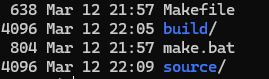
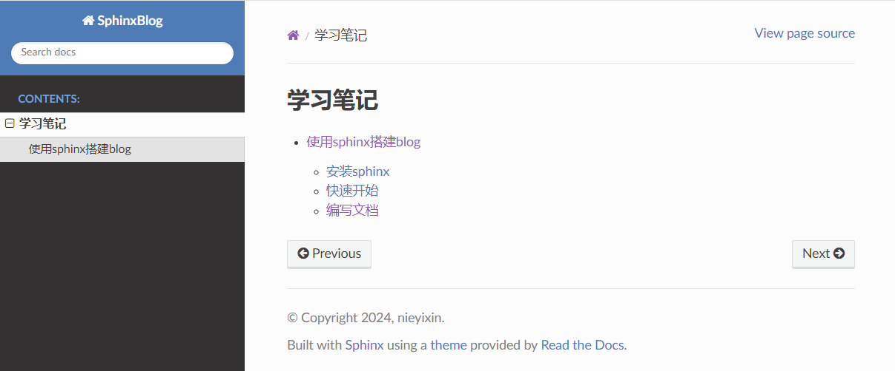
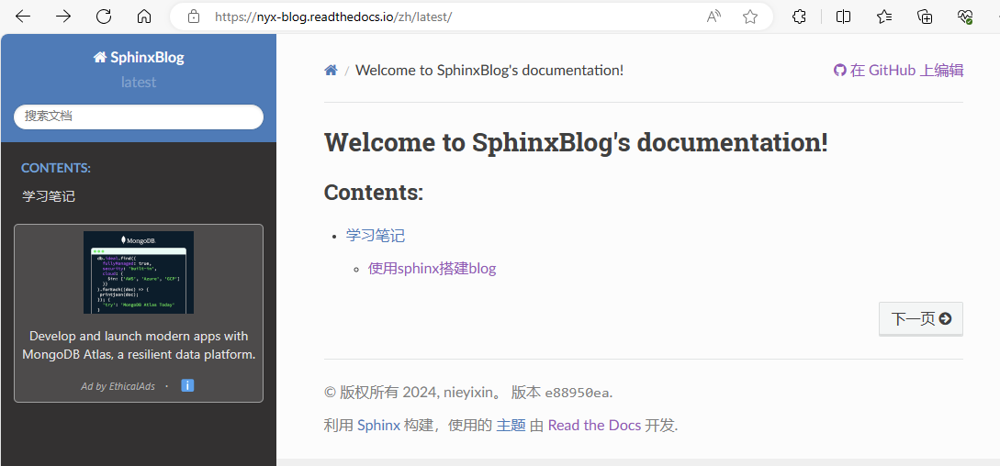

## 使用sphinx搭建blog

### 安装sphinx

安装sphinx以及依赖  
```
pip3 install sphinx
```

安装其他软件包

```
pip3 install sphinx-autobuild # 热部署，改动能够实时更新在页面上
pip3 install sphinx_red_theme # 主题
pip3 install recommonmark # 插件，支持markdown
pip3 install sphinx_markdown_tables
```

### 快速开始

创建并进入sphinx_blog目录，执行命令

```
sphinx-quickstart
```

窗口会询问你是否选择独立的源文件和构建目录，这里选择y

然后会要求你输入项目名称、作者以及版本信息，这里直接填入即可，后续可在配置文件中修改

项目创建完成，目录结构如下所示



其中Makefile是构建脚本，这里不用过多关心；make.bat用于Windows系统下的构建；build目录存放构建产物，执行命令`make html`会在build目录下生成html文件，通过浏览器打开html文件，可以看到sphinx生成的网页

#### 修改配置文件 
修改配置文件conf.py，配置插件和主题：

```
extensions = ['recommonmark', 'sphinx_markdown_tables']

html_theme = 'sphinx_rtd_theme'
```

#### 启动 

我们选择使用autobuild进行热部署，这样我们修改了配置文件或者文本文件可以实时更新，执行命令
```
sphinx_autobuild source build/html --host=<host> --port=<port>
```
其中host和port不用指定，默认为127.0.0.1地址和8080端口

然后访问http://ip:port即可看到sphinx的默认页面


### 编写文档

#### 编写index.rst

通过index.rst编写文档目录树结构，能够帮助从主页面逐级索引到目标文档

例如，主页面有如下的目录结构：  

Contents:  
|  
|--content1.md  
|  
|--menu   
&nbsp;&nbsp;&nbsp;|  
&nbsp;&nbsp;&nbsp;|--content2.md  

主目录下有一篇content1.md和二级目录menu，menu下有一篇content2.md

所以我们在source/index.rst编辑目录树：
```
.. toctree::
   :maxdepth: 2
   :caption: Contents:
   
   content1
   menu/index
```
表示主目录下会有content1文档和menu这个二级目录

再编辑source/menu/index.rst:
```
.. toctree::
   :maxdepth: 2
   :caption: menu
   
   content2
```
表示menu二级目录下有content2这篇文档

#### 编写文档
创建source/content1.md、source/menu/content2.md，编辑并保存。由于打开了热部署，保存时，页面就会实时刷新



### 文档托管

要将文档托管到网页上，首先需要为sphinx项目创建github仓库，具体步骤省略

然后在[Read the Docs](https://readthedocs.org/)网站上注册，绑定github账号后，将该项目导入即可。

#### 添加.readthedocs.yaml
.readthedocs.yaml配置文件用于托管时的配置，在Read the Docs网站上有样例。我们需要填入的内容如下所示：
```
sphinx:
  configuration: source/conf.py


python:
   install:
   - requirements: requirements.txt
```
分别表示sphinx项目的conf.py路径和requirements路径

#### 添加requirements.txt

我们在项目根目录新建requirements.txt，并填入前文提到的python库：

```
sphinx-rtd_theme==2.0.0
recommonmark==0.7.1
sphinx_markdown_tables==0.0.17
```

最后我们的博客网站就托管成功了：



### 参考博客

[Sphinx + Read the Docs从懵逼到入门](https://zhuanlan.zhihu.com/p/264647009)
