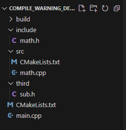
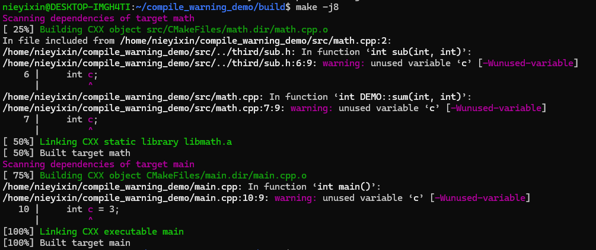
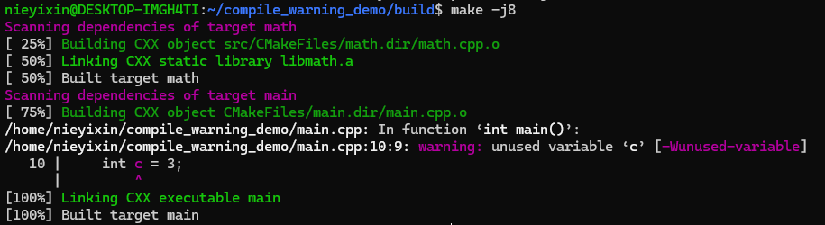
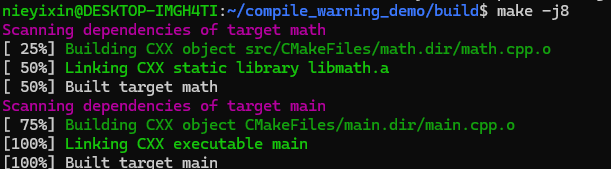
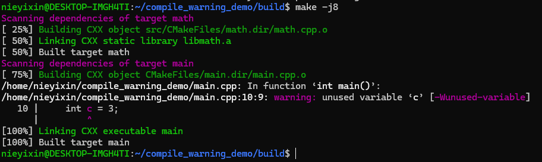
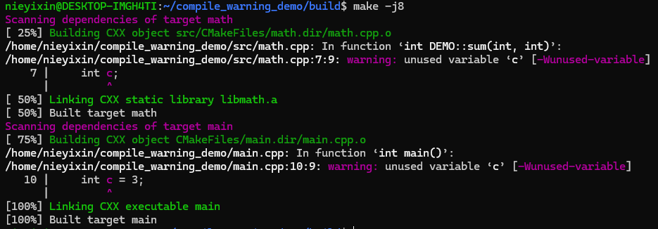

## 屏蔽三方库的编译告警
在项目代码中用到了三方库Eigen和protobuf，在编译时三方库的一些告警常常会刷屏，十分影响构建问题定位（强迫症很难受）

对于该问题，第一时间想到的是通过修改编译选项为`-Wno-xxx`来屏蔽特定告警，但这样修改会屏蔽掉代码中所有的编译告警，这是有悖项目质量管理要求的

有没有一种方法可以只屏蔽三方库的告警，而不影响业务代码中的编译告警检查？下文针对Eigen和protobuf三方库，介绍了几种方案

### 样例

#### 三方库
为模拟了Eigen这种“Header Only”三方库，选择在头文件中实现一个减法函数，函数中包含一个`Wunused-variable`编译告警

**sub.h**
```
#ifndef _THIRD_SUB_H
#define _THIRD_SUB_H

int sub(int a, int b)
{
    int c;
    return a-b;
}
#endif
```
#### math库
math库是源码中一个target，实现了加法和减法两个方法。其中加法是自己实现，而减法是通过调用*sub.h*实现。自己实现的加法中也包含了一个`Wunused-variable`编译告警

**math.h**
```
#ifndef _MATH_HEADER_
#define _MATH_HEADER_

namespace DEMO {
int sum(int a, int b);
int sub(int a, int b);
}
#endif
```

**math.cpp**
```
#include "math.h"
#include "sub.h"

namespace DEMO {
int sum(int a, int b)
{
    return a + b;
}

int sub(int a, int b)
{
    return sub(a, b);
}
}
```

**CMakeLists.txt**
```
add_library(math ${CMAKE_CURRENT_SOURCE_DIR}/math.cpp)
target_include_directories(math PUBLIC ${CMAKE_SOURCE_DIR}/include ${CMAKE_CURRENT_SOURCE_DIR}/../third)
```

#### main
main函数调用了math库的加法和减法方法，并打印出来。main方法中也包含了一个`Wunused-variable`编译告警

**main.cpp**
```
#include <iostream>
#include "math.h"

using namespace DEMO;

int main()
{
    int a = 1;
    int b = 2;
    int c = 3;
    std::cout << sum(a, b) << std::endl;
    std::cout << sub(a, b) << std::endl;
    return 0;
}
```

**CMakeLists.txt**

```
project(compile_warning_demo)
cmake_minimum_required(VERSION 3.16)
set(CMAKE_CXX_COMPILER "/usr/bin/g++")
set(CMAKE_C_COMPILER "/usr/bin/gcc")
add_compile_options(-Wall)
add_subdirectory(src)

add_executable(main main.cpp)
target_include_directories(main PRIVATE ${CMAKE_CURRENT_SOURCE_DIR}/third)
target_link_libraries(main PRIVATE math)
```

*CMakeLists.txt*指定了编译器，设置编译选项为`-Wall`来显示所有告警，同时main链接了math库，并指定了头文件搜索路径

#### 代码结构   

目录结构如下所示




在build目录下执行如下命令
```
cmake ..
make -j8
```
打印如下所示



可以看到*main.cpp*，*math.h*和*sub.h*中的编译告警
### 修改CMakeLists.txt

现代C++项目，通常是选择CMake进行构建的。能否通过修改CMake脚本，来控制对三方库的编译选项？

#### target_compile_options
`target_compile_optioins`用于向target添加编译选项

修改*src/CMakeLists.txt*
```
add_library(math ${CMAKE_CURRENT_SOURCE_DIR}/math.cpp)
target_include_directories(math PUBLIC ${CMAKE_SOURCE_DIR}/include ${CMAKE_CURRENT_SOURCE_DIR}/../third)
target_compile_options(math PRIVATE -Wno-unused-variable)
```
其中`-Wno-unused-variable`能够屏蔽`Wunused-variable`告警，重新编译结果如下



可以看到*math.cpp*和*sub.h*的编译告警都没有了。
如果我们把`target_compile_options(math PRIVATE -Wno-unused-variable)`中的`PRIVATE`改成`PUBLIC`会怎样呢？修改后重新编译结果如下



可见所有的编译告警全都消失了

这是因为当作用域为`PUBLIC`和`PRIVATE`时，该编译选项会被填充到target的`COMPILE_OPTION`属性上，作用域为`PUBLIC`和`INTERFACE`时，会被填充到`INTERFACE_COMPILE_OPTION`属性上

其中`COMPILE_OPTION`表示target自身的属性，而`INTERFACE_COMPILE_OPTION`表示链接一方的属性。换言之，`PUBLIC`和`INTERFACE`是对外属性，而`PUBLIC`和`PRIVATE`是对内属性

由于math的`COMPILE_OPTION`属性是对外的，main链接math库时，会传递math的编译选项，因此main的编译选项也为`-Wno-unused-variable`了

不难得出，该方法的粒度是target级别的，只能对target设置编译选项，最小粒度也是全部屏蔽math库的告警，无法只对*sub.h*进行屏蔽

#### CMAKE_CXX_FLAGS
`CMAKE_CXX_FLAGS`可用于设置编译选项，其范围是单个文件

修改*src/CMakeLists.txt*
```
add_library(math ${CMAKE_CURRENT_SOURCE_DIR}/math.cpp)
target_include_directories(math PUBLIC ${CMAKE_SOURCE_DIR}/include ${CMAKE_CURRENT_SOURCE_DIR}/../third)
set(CMAKE_CXX_FLAGS -Wno-unused-variable)
```
重新编译结果如下



可以看到屏蔽了*math.cpp*和*sub.h*中的编译告警。可见其粒度是单个编译文件，无法只屏蔽*sub.h*的编译告警
#### set_source_file_properties
`set_source_file_properties`方法用于设置源文件的属性，包括编译选项

修改*src/CMakeLists.txt*
```
add_library(math ${CMAKE_CURRENT_SOURCE_DIR}/math.cpp)
target_include_directories(math PUBLIC ${CMAKE_SOURCE_DIR}/include ${CMAKE_CURRENT_SOURCE_DIR}/../third)
set_source_files_properties(${CMAKE_CURRENT_SOURCE_DIR}/math.cpp PROPERTIES COMPILE_OPTIONS -Wno-unused-variable)
```
重新编译结果如下


结果与设置`CMAKE_CXX_FLAGS`一致

### 修改代码

上述方法中，屏蔽编译告警的最小粒度只能到源文件，有没有办法可以只屏蔽*sub.h*中的编译告警呢？

众所周知，在预编译时，源文件会展开所有包含的头文件。在上例中，*sub.h*的头文件被*math.cpp*包含，而经过与编译后，*math.cpp*展开后，包含了自身的编译告警和sub.h的编译告警

要仅仅屏蔽*sub.h*的编译告警，那么只能在编译前，也就是预编译时做些“手脚”了

在include目录下新增*sub_without_warn.h*

```
#ifndef _SUB_WITHOUT_WARN_
#define _SUB_WITHOUT_WARN_
#pragma GCC diagnostic push
#pragma GCC diagnostic ignored "-Wunused-variable"
#include "sub.h"
#pragma GCC diagnostic pop
#endif
```

同时修改*math.cpp*的`#include "sub.h"`为`#include "sub_without_warn.h"`，重新编译后结果如下



可以看到成功屏蔽了*sub.h*中的编译告警，而没有屏蔽*math.cpp*和*main.cpp*

这里用到了`progma`预处理指令，其中`GCC diagnostic push`表示用于记录当前的诊断状态，而`GCC diagnostic pop`表示恢复诊断状态。`GCC diagnostic ignored "-Wunused-variable"`表示忽略`Wunused-variable`告警

所以在预处理时，当编译到*sub.h*在*math.cpp*代码展开的片段时，其编译选项为忽略`Wunused-variable`告警；而编译其他代码片段时，已经通过`GCC diagnostic pop`恢复，所以正常输出告警

因此，可以通过新增头文件，头文件中包含三方库头文件，并添加预处理指令，来屏蔽三方库的编译告警
